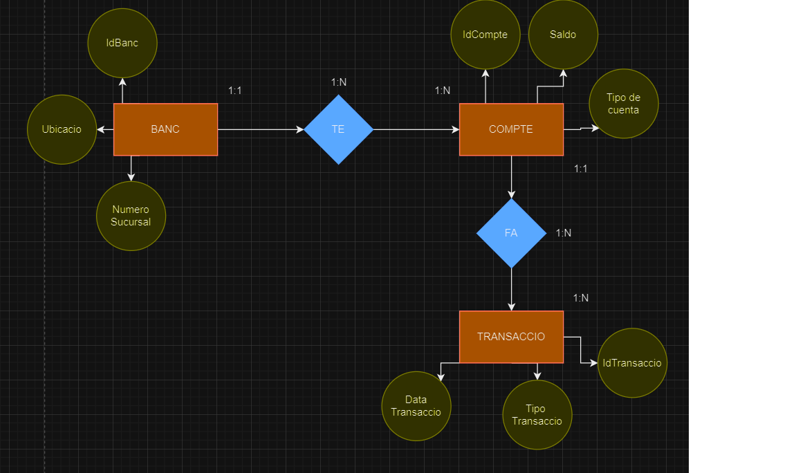

# Aquest es el nostre MER



## Comandes SQL per crear les taules

```sql
-- Comanda SQL per crear la taula Exemple
CREATE TABLE banc (
    IdBanc INT PRIMARY KEY,
    Ubicacio VARCHAR(50),
    NumSucursal INT
);

CREATE TABLE Compte (
    IdCompte INT PRIMARY KEY,
    Saldo FLOAT,
    TipoCuenta VARCHAR
);

CREATE TABLE Transsacio (
    IdTransaccio INT PRIMARY KEY,
    TipoTransaccio VARCHAR(50),
    DataTransaccio DATE
);
